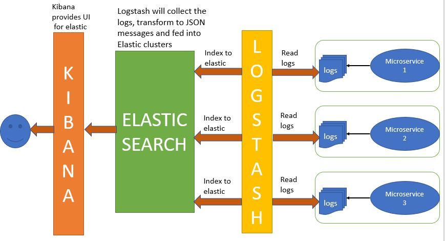

# spring-boot-elk-microservices
A complete hands-on project demonstrating real-time log monitoring using Spring Boot microservices integrated with the ELK Stack (Elasticsearch, Logstash, Kibana). Includes Docker-based ELK setup, Logstash pipeline configuration, structured JSON logging, and dashboards for centralized log analysis.

---
# 🧭 Training Plan (Like a Real Mentor)

We will build this project in **6 phases**, one by one.


## 🎓 Phase 1 — Architecture Setup & Understanding


## 🎓 Phase 2 — Prepare ELK Using Docker (Hands-On)


## 🎓 Phase 3 — Create 4 Spring Boot Microservices


## 🎓 Phase 4 — Configure Logback to Send Logs to Logstash


## 🎓 Phase 5 — Create Logstash Pipeline


## 🎓 Phase 6 — Create Kibana Dashboards & Visualizations

---

# ✅ PHASE 1 — Architecture Setup & Understanding 
## What is ELK Stack and Why Do We Use It?

ELK is in high demand in Spring Boot applications due to its powerful logging and monitoring capabilities.  
The **ELK stack** is a collection of three open-source products:

- **Elasticsearch** → Works as a search engine and NoSQL database. It can search and analyze large collections of data.  
- **Logstash** → A log pipeline tool that accepts data, processes it into different parts, and exports it to target locations.  
- **Kibana** → A visualization layer (UI) that sits above Elasticsearch, allowing you to explore and visualize logs.  


## 🏗 Spring Boot + ELK Stack

For example:  
Suppose there are **100 applications** running, all generating logs in the same target location.  
If you need a single log file from one particular application, finding it manually would be tedious.  

➡ With **ELK**, you can search and filter logs in **real-time** without inconvenience.


## 📊 Architecture Diagram




---


# 📖 Phase 2 — ELK docker-compose Deep Dive

Absolutely! I will explain Phase 2 (ELK docker-compose) and Phase 3 (logback-spring.xml) line-by-line like a real trainer so you understand every component clearly.


## 🧭 PHASE 2 — Deep Explanation of ELK docker-compose.yml


### 🟦 PART 1: Understanding Docker Compose Structure

The docker-compose.yml defines three containers:

- **Elasticsearch** → Stores & indexes logs  
- **Kibana** → User UI to view logs  
- **Logstash** → Reads incoming logs & forwards to Elasticsearch  

All three share a network called **elk** so they can communicate internally.


### 🟨 PART 2: Understanding Each Section in Detail

#### 1️⃣ Elasticsearch Service

**Image:** `docker.elastic.co/elasticsearch/elasticsearch:8.12.0`  
✔ Why image 8.12.0?  
- Version 8.x is stable and widely used.

**Container name:** `elasticsearch`  
- You give a name instead of auto-generated one.  
- Makes debugging easier.

**Environment Variables:**  
- `discovery.type=single-node`  
  - Tells Elasticsearch to run in single-node mode  
  - ➡ No cluster formation  
  - ➡ Perfect for local development / training  

- `xpack.security.enabled=false`  
  - Disables security (passwords/authentication).  
  - ➡ For learning mode this is fine  
  - ➡ In production, this MUST be enabled!  

- `ES_JAVA_OPTS=-Xms1g -Xmx1g`  
  - Sets JVM heap size for Elasticsearch.  
  - Xms = minimum heap  
  - Xmx = maximum heap  
  - Elasticsearch needs RAM, ideally:  
    - Minimum → 1GB  
    - Recommended → 2GB+  

**Port Mapping:**  
- `9200:9200` → Elasticsearch REST API  
- Access in browser: `http://localhost:9200`  

**Volume:**  
- `es-data:/usr/share/elasticsearch/data`  
- Purpose: Saves Elasticsearch indexes  
- If you restart Docker, your logs DO NOT disappear  

**Network:**  
- `elk` → All services communicate in this private network  


#### 2️⃣ Kibana Service

**Image:** `docker.elastic.co/kibana/kibana:8.12.0`  
- Kibana UI to view log dashboards.

**Ports:**  
- `5601:5601` → Access Kibana UI at `http://localhost:5601`  

**Depends_on:**  
- Ensures Elasticsearch must start first  
- Kibana waits until Elasticsearch is running  

**Environment:**  
- `ELASTICSEARCH_HOSTS=http://elasticsearch:9200`  
- Kibana connects to Elasticsearch inside the docker network using `elasticsearch:9200`  


#### 3️⃣ Logstash Service

**Image:** `docker.elastic.co/logstash/logstash:8.12.0`  
- Logstash receives logs from Spring Boot and forwards to Elasticsearch.

**Port Mapping:**  
- `5044:5044` → This is the port where Spring Boot sends logs using Logback TCP.  

**Pipeline Mount:**  
- `./logstash/pipeline:/usr/share/logstash/pipeline`  
- Meaning: Your local folder `logstash/pipeline` is copied inside the container  
- So you can define pipelines like `logstash.conf`  


#### 🔹 Networks & Volumes Definitions

At bottom:  

- **Volumes:**  
  - `es-data` → Creates persistent storage  

- **Networks:**  
  - `elk` → All services share a private network called “elk”  

#### 🚀 How to Run ELK Stack

Run the following in your project folder:
```
docker-compose up -d
```


Check running containers:
```
docker ps
```

🌐 Access Points After Start
Component	URL
 - Elasticsearch	http://localhost:9200

- Kibana Dashboard	http://localhost:5601

- Logstash Input	tcp://localhost:5044

#### 🛠 Useful Commands
Stop containers:

```
docker-compose down
```
View logs:

```
docker-compose logs -f
```
Restart containers:

```
docker-compose restart
```

#### 📚 References
- [Elasticsearch Documentation](https://www.elastic.co/docs/get-started)

- [Kibana Documentation](https://www.elastic.co/docs/get-started/the-stack)

- [Logstash Documentation](https://www.elastic.co/docs/reference/logstash)

---

# 🎓 Phase 3 — Create 4 Spring Boot Microservices
- Eureka Server

- Product Service

- Order Service

- Payment Service

# 📘 1. Eureka Server – Project Description (Spring Boot 3.5.8 + Java 17)

This project is the **Service Discovery Server** built using **Spring Boot 3** and **Spring Cloud Netflix Eureka**.  
It plays a central role in the microservices architecture by enabling dynamic discovery and registration of services.


## 🔥 Key Responsibilities of Eureka Server

- Maintains a central registry of all active microservices.
- Allows services (Product, Order, Payment) to discover each other without hard-coding URLs.
- Provides a web dashboard at [http://localhost:8761](http://localhost:8761) for:
    - Viewing registered instances
    - Instance health status
    - Heartbeat monitoring


## 🧩 Tech Stack

- Spring Boot 3.5.8
- Spring Cloud Netflix Eureka Server
- Spring Web (required for Eureka UI)
- Java 17
- Maven


## 📦 Included Dependencies

- `spring-cloud-starter-netflix-eureka-server`
- `spring-boot-starter-web` *(Eureka dashboard requires a web environment)*


## 🚀 Purpose in the Architecture

Eureka Server is the **first microservice to start** in the entire system.  
All other services (Product, Order, Payment) will:

- ✔ Register themselves with Eureka
- ✔ Fetch other service locations dynamically
- ✔ Communicate without knowing actual server IP/port

This makes the architecture **scalable**, **fault-tolerant**, and **cloud-ready**.

---

# 🚀 2. Product Service – Microservice (Spring Boot 3.5.8 + Java 17)

The **Product Service** is a core microservice responsible for managing product information and exposing fully validated CRUD APIs.  
It integrates seamlessly with **Eureka Discovery**, **H2 Database**, **Spring Data JPA**, and the **ELK Stack (Logstash → Elasticsearch → Kibana)** for structured JSON logging.

---

## 📘 Project Description

### This service provides APIs to:
- ➕ Create product  
- ✏️ Update product  
- 🔍 Get product by ID  
- 📃 List all products  
- ❌ Delete product  

### Additional capabilities:
- ✔ Auto-registers with Eureka Server as **product-service**  
- ✔ Structured JSON logs sent to ELK stack  
- ✔ Input validation using `jakarta.validation`  
- ✔ Global exception handling with consistent responses  

---

## 🧩 Tech Stack

| Component | Version |
|----------|---------|
| **Framework** | Spring Boot 3.5.8 |
| **Java Version** | 17 |
| **Build Tool** | Maven |
| **Database** | H2 (In-Memory) |
| **ORM** | Spring Data JPA + Hibernate |
| **Discovery Service** | Eureka Client |
| **Logging** | Logstash JSON Encoder + Logback |
| **Cloud** | Spring Cloud 2025.0.1 |
| **Boilerplate Reduction** | Lombok |

---

## 📦 Included Dependencies

- `spring-boot-starter-web` – REST APIs  
- `spring-boot-starter-data-jpa` – ORM & Repositories  
- `spring-boot-starter-validation` – Request validation  
- `spring-boot-starter-actuator` – Health checks  
- `spring-cloud-starter-netflix-eureka-client` – Eureka registration  
- `h2` – In-memory database  
- `logstash-logback-encoder` – JSON logs for ELK  
- `lombok`  

---

## ⚙️ Prerequisites Before Running

### ✔ 1. Eureka Server must be running

Visit Eureka Dashboard:  
👉 http://localhost:8761  

The service registers as:  
`product-service`

### ✔ 2. ELK Stack must be running
- Logstash  
- Elasticsearch  
- Kibana  

**Logs flow as:**  
Product Service → Logstash → Elasticsearch → Kibana  

---

## 🗄️ Connecting to H2 Database

Open browser:  
👉 http://localhost:8081/h2-console

### Connection Details

| Property | Value |
|---------|-------|
| Driver Class | org.h2.Driver |
| JDBC URL | jdbc:h2:mem:products |
| Username | sa |
| Password | password |

---

## 📊 Checking Logs in Logstash & Kibana

### Example Log Entry
```json
{
  "@timestamp": "2025-11-30T10:35:12",
  "level": "INFO",
  "logger": "com.elk.product.service.impl.ProductServiceImpl",
  "message": "Product created successfully: id=1, name=Laptop",
  "service": "product-service"
}
```

### Kibana Log Viewer
👉 http://localhost:5601 → Discover → Index Pattern: `app-logs-*`

---

## 🌐 Exposed Endpoints

| Method | Endpoint | Description |
|--------|----------|-------------|
| GET | `/api/v1/products` | List all products |
| GET | `/api/v1/products/{id}` | Get product by ID |
| POST | `/api/v1/products` | Create product |
| PUT | `/api/v1/products/{id}` | Update product |
| DELETE | `/api/v1/products/{id}` | Delete product |

---

## 🛠️ Configuration (`application.yml`)

```yaml
server:
  port: 8081

spring:
  application:
    name: product-service

  datasource:
    url: jdbc:h2:mem:products
    driver-class-name: org.h2.Driver
    username: sa
    password: password

  jpa:
    hibernate:
      ddl-auto: update
    show-sql: true

eureka:
  client:
    serviceUrl:
      defaultZone: http://localhost:8761/eureka/
```

---

## 📤 Sample API Usage

### 🔹 Create Product
`POST /api/v1/products`

#### Request Body
```json
{
  "productCode": "P100",
  "name": "Laptop",
  "description": "High performance laptop",
  "price": 55000,
  "stockQuantity": 10,
  "status": "ACTIVE"
}
```

---

### ✅ Success Response
```json
{
  "timestamp": "2025-11-29T12:10:45",
  "status": 200,
  "message": "Product fetched successfully",
  "data": {
    "id": 1,
    "productCode": "P100",
    "name": "Laptop",
    "description": "High performance laptop",
    "price": 55000,
    "stockQuantity": 10,
    "status": "ACTIVE"
  },
  "path": "http://localhost:8081/api/v1/products/1"
}
```

---

### ❌ Error Response (Validation Failure)
```json
{
  "timestamp": "2025-11-29T12:11:22",
  "status": 400,
  "error": "BAD_REQUEST",
  "message": "Validation failed",
  "fieldErrors": {
    "name": "Product name cannot be empty",
    "price": "Price must be greater than 0"
  },
  "path": "/api/v1/products"
}
```

---

### 🔹 Get Product by ID
`GET /api/v1/products/{id}`

#### Request Example
```
GET http://localhost:8081/api/v1/products/1
```

---

### ✅ Success Response
```json
{
  "timestamp": "2025-11-29T12:15:20",
  "status": 200,
  "message": "Product fetched successfully",
  "data": {
    "id": 1,
    "productCode": "P100",
    "name": "Laptop",
    "description": "High performance laptop",
    "price": 55000,
    "stockQuantity": 10,
    "status": "ACTIVE"
  },
  "path": "http://localhost:8081/api/v1/products/1"
}
```

---

### 🔹 List All Products
`GET /api/v1/products`

#### Request Example
```
GET http://localhost:8081/api/v1/products
```

---

### ✅ Success Response
```json
{
  "timestamp": "2025-11-29T12:20:10",
  "status": 200,
  "message": "All products fetched successfully",
  "data": [
    {
      "id": 1,
      "productCode": "P100",
      "name": "Laptop",
      "description": "High performance laptop",
      "price": 55000,
      "stockQuantity": 10,
      "status": "ACTIVE"
    },
    {
      "id": 2,
      "productCode": "P101",
      "name": "Mouse",
      "description": "Wireless mouse",
      "price": 500,
      "stockQuantity": 100,
      "status": "ACTIVE"
    }
  ],
  "path": "http://localhost:8081/api/v1/products"
}
```

---

### 🔹 Update Product
`PUT /api/v1/products/{id}`

#### Request Body
```json
{
  "productCode": "P100",
  "name": "Laptop Pro",
  "description": "High performance gaming laptop",
  "price": 75000,
  "stockQuantity": 5,
  "status": "ACTIVE"
}
```

---

### ✅ Success Response
```json
{
  "timestamp": "2025-11-29T12:25:45",
  "status": 200,
  "message": "Product updated successfully",
  "data": {
    "id": 1,
    "productCode": "P100",
    "name": "Laptop Pro",
    "description": "High performance gaming laptop",
    "price": 75000,
    "stockQuantity": 5,
    "status": "ACTIVE"
  },
  "path": "http://localhost:8081/api/v1/products/1"
}
```

---

### 🔹 Delete Product
`DELETE /api/v1/products/{id}`

#### Request Example
```
DELETE http://localhost:8081/api/v1/products/1
```

---

### ✅ Success Response
```json
{
  "timestamp": "2025-11-29T12:30:15",
  "status": 200,
  "message": "Product deleted successfully",
  "path": "http://localhost:8081/api/v1/products/1"
}
```

---

## 🧩 Highlights

- ✔ Controller validates requests using `@Valid`  
- ✔ `ApiResponse<T>` ensures uniform responses  
- ✔ GlobalExceptionHandler covers validation, not found, and generic errors  
- ✔ `MapperUtil` converts DTO ↔ Entity  
- ✔ Full JSON-structured logs for ELK  

---

# 🚀 3. Order Service – Microservice (Spring Boot 3.5.9 + Java 17)

The **Order Service** is a core microservice responsible for managing customer orders and coordinating with the Product Service for product validation and pricing.

It integrates seamlessly with **Eureka Discovery**, **H2 Database**, **Spring Data JPA**, **OpenFeign**, and the **ELK Stack (Logstash → Elasticsearch → Kibana)** for structured JSON logging.

---

## 📘 Project Description

### This service provides APIs to:
- ➕ Create order
- 🔍 Get order by ID
- 📃 List all orders
- 🔎 Get orders by customer ID
- 📊 Get orders by status
- 🧾 Get order summary (projection-based)

### Additional capabilities:
- ✔ Auto-registers with Eureka Server as **order-service**
- ✔ Communicates with **product-service** using OpenFeign
- ✔ Structured JSON logs sent to ELK stack
- ✔ Input validation using `jakarta.validation`
- ✔ Global exception handling with consistent responses
- ✔ Standardized `ApiResponse<T>` wrapper

---

## 🧩 Tech Stack

| Component | Version |
|----------|---------|
| **Framework** | Spring Boot 3.5.9 |
| **Java Version** | 17 |
| **Build Tool** | Maven |
| **Database** | H2 (In-Memory) |
| **ORM** | Spring Data JPA + Hibernate |
| **Discovery Service** | Eureka Client |
| **Inter-Service Communication** | OpenFeign |
| **Logging** | Logstash JSON Encoder + Logback |
| **Cloud** | Spring Cloud 2025.0.1 |
| **Boilerplate Reduction** | Lombok |

---

## 📦 Included Dependencies

- `spring-boot-starter-web` – REST APIs
- `spring-boot-starter-data-jpa` – ORM & Repositories
- `spring-boot-starter-validation` – Request validation
- `spring-boot-starter-actuator` – Health checks
- `spring-cloud-starter-netflix-eureka-client` – Eureka registration
- `spring-cloud-starter-openfeign` – Inter-service communication
- `h2` – In-memory database
- `logstash-logback-encoder` – JSON logs for ELK
- `lombok`

---

## ⚙️ Prerequisites Before Running

### ✔ 1. Eureka Server must be running

Visit Eureka Dashboard:  
👉 http://localhost:8761

The service registers as:  
`order-service`

---

### ✔ 2. Product Service must be running

Order Service depends on Product Service for:
- Product validation
- Fetching price details

---

### ✔ 3. ELK Stack must be running

- Logstash
- Elasticsearch
- Kibana

**Logs flow as:**  
Order Service → Logstash → Elasticsearch → Kibana

---

## 🗄️ Connecting to H2 Database

Open browser:  
👉 http://localhost:8082/h2-console

### Connection Details

| Property | Value |
|---------|-------|
| Driver Class | org.h2.Driver |
| JDBC URL | jdbc:h2:mem:orders |
| Username | sa |
| Password | password |

---

## 📊 Checking Logs in Logstash & Kibana

### Example Log Entry
```json
{
  "@timestamp": "2026-01-05T10:35:12",
  "level": "INFO",
  "logger": "com.elk.order.service.impl.OrderServiceImpl",
  "message": "Order created successfully: id=1, orderNumber=ORD-20260105-0001",
  "service": "order-service"
}
```

### Kibana Log Viewer
👉 http://localhost:5601 → Discover → Index Pattern: `app-logs-*`

---

## 🌐 Exposed Endpoints

| Method | Endpoint | Description |
|--------|----------|-------------|
| POST | `/api/v1/orders` | Create order |
| GET | `/api/v1/orders` | List all orders |
| GET | `/api/v1/orders/{id}` | Get order by ID |
| GET | `/api/v1/orders/customer/{customerId}` | Get orders by customer |
| GET | `/api/v1/orders/status/{status}` | Get orders by status |
| GET | `/api/v1/orders/summary` | Get summarized order data |

---

## 🛠️ Configuration (`application.yml`)

```yaml
server:
  port: 8082

spring:
  application:
    name: order-service

  datasource:
    url: jdbc:h2:mem:orders
    driver-class-name: org.h2.Driver
    username: sa
    password: password

  jpa:
    hibernate:
      ddl-auto: update
    show-sql: true

eureka:
  client:
    serviceUrl:
      defaultZone: http://localhost:8761/eureka/
```

---

## 📤 Sample API Usage

### 🔹 Create Order
`POST /api/v1/orders`

#### Request Body
```json
{
  "customerId": "CUST-101",
  "items": [
    {
      "productId": 1,
      "quantity": 2
    }
  ]
}
```

---

### ✅ Success Response
```json
{
  "timestamp": "2026-01-05T12:10:45",
  "status": 201,
  "message": "Order created successfully",
  "data": {
    "id": 1,
    "orderNumber": "ORD-20260105-0001",
    "customerId": "CUST-101",
    "status": "CREATED",
    "totalAmount": 110000
  },
  "path": "http://localhost:8082/api/v1/orders/1"
}
```

---

### ❌ Error Response (Validation Failure)
```json
{
  "timestamp": "2026-01-05T12:11:22",
  "status": 400,
  "error": "VALIDATION_FAILED",
  "message": "Input validation failed",
  "fieldErrors": {
    "customerId": "Customer ID cannot be empty",
    "items": "Order must contain at least one item"
  },
  "path": "/api/v1/orders"
}
```

---

### ❌ Error Response (Product Not Found)
```json
{
  "timestamp": "2026-01-05T12:15:10",
  "status": 404,
  "error": "PRODUCT_NOT_FOUND",
  "message": "Product with ID 10 not found",
  "path": "/api/v1/orders"
}
```

---

### ❌ Error Response (Product Service Down)
```json
{
  "timestamp": "2026-01-05T12:18:44",
  "status": 503,
  "error": "SERVICE_UNAVAILABLE",
  "message": "Product Service is currently unavailable",
  "path": "/api/v1/orders"
}
```

---

### 🔹 Get Order by ID
`GET /api/v1/orders/{id}`

#### Request Example
```
GET http://localhost:8082/api/v1/orders/1
```

---

### ✅ Success Response
```json
{
  "timestamp": "2026-01-05T12:30:20",
  "status": 200,
  "message": "Order details fetched successfully",
  "data": {
    "id": 1,
    "orderNumber": "ORD-20260105-0001",
    "customerId": "CUST-101",
    "status": "CREATED",
    "totalAmount": 110000
  },
  "path": "http://localhost:8082/api/v1/orders/1"
}
```

---

### 🔹 List All Orders
`GET /api/v1/orders`

#### Request Example
```
GET http://localhost:8082/api/v1/orders
```

---

### ✅ Success Response
```json
{
  "timestamp": "2026-01-05T12:35:45",
  "status": 200,
  "message": "All orders fetched successfully",
  "data": [
    {
      "id": 1,
      "orderNumber": "ORD-20260105-0001",
      "customerId": "CUST-101",
      "status": "CREATED",
      "totalAmount": 110000
    },
    {
      "id": 2,
      "orderNumber": "ORD-20260105-0002",
      "customerId": "CUST-102",
      "status": "COMPLETED",
      "totalAmount": 55000
    }
  ],
  "path": "http://localhost:8082/api/v1/orders"
}
```

---

### 🔹 Get Orders by Customer ID
`GET /api/v1/orders/customer/{customerId}`

#### Request Example
```
GET http://localhost:8082/api/v1/orders/customer/CUST-101
```

---

### ✅ Success Response
```json
{
  "timestamp": "2026-01-05T12:40:30",
  "status": 200,
  "message": "Orders fetched successfully",
  "data": [
    {
      "id": 1,
      "orderNumber": "ORD-20260105-0001",
      "customerId": "CUST-101",
      "status": "CREATED",
      "totalAmount": 110000
    },
    {
      "id": 3,
      "orderNumber": "ORD-20260105-0003",
      "customerId": "CUST-101",
      "status": "PENDING",
      "totalAmount": 25000
    }
  ],
  "path": "http://localhost:8082/api/v1/orders/customer/CUST-101"
}
```

---

### 🔹 Get Orders by Status
`GET /api/v1/orders/status/{status}`

#### Request Example
```
GET http://localhost:8082/api/v1/orders/status/COMPLETED
```

---

### ✅ Success Response
```json
{
  "timestamp": "2026-01-05T12:45:15",
  "status": 200,
  "message": "Orders fetched successfully",
  "data": [
    {
      "id": 2,
      "orderNumber": "ORD-20260105-0002",
      "customerId": "CUST-102",
      "status": "COMPLETED",
      "totalAmount": 55000
    }
  ],
  "path": "http://localhost:8082/api/v1/orders/status/COMPLETED"
}
```

---

### 🔹 Get Order Summary
`GET /api/v1/orders/summary`

#### Request Example
```
GET http://localhost:8082/api/v1/orders/summary
```

---

### ✅ Success Response
```json
{
  "timestamp": "2026-01-05T12:50:00",
  "status": 200,
  "message": "Order summary fetched successfully",
  "data": [
    {
      "orderNumber": "ORD-20260105-0001",
      "customerId": "CUST-101",
      "totalAmount": 110000,
      "status": "CREATED"
    },
    {
      "orderNumber": "ORD-20260105-0002",
      "customerId": "CUST-102",
      "totalAmount": 55000,
      "status": "COMPLETED"
    }
  ],
  "path": "http://localhost:8082/api/v1/orders/summary"
}
```

---

## 🧩 Highlights

- ✔ Order creation validates products using OpenFeign
- ✔ `@Valid` ensures request-level validation
- ✔ `ApiResponse<T>` ensures uniform responses
- ✔ GlobalExceptionHandler handles validation, Feign, and generic errors
- ✔ JPQL constructor projection used for summary endpoint
- ✔ Full JSON-structured logs for ELK
- ✔ Clean microservice architecture with service discovery

---
# 💳 4. Payment Service – Microservice (Spring Boot 3.5.11 + Java 17)

The **Payment Service** is a core microservice responsible for processing payments for customer orders and validating order details through inter-service communication.

It integrates seamlessly with **Eureka Discovery**, **H2 Database**, **Spring Data JPA**, **OpenFeign**, and the **ELK Stack (Logstash → Elasticsearch → Kibana)** for structured JSON logging.

---

## 📘 Project Description

### This service provides APIs to:
- 💳 Process payment
- 🔍 Get payment by ID
- 📃 List all payments
- 🔎 Get payments by order ID
- 📊 Get payments by status

### Additional capabilities:
- ✔ Auto-registers with Eureka Server as **payment-service**
- ✔ Communicates with **order-service** using OpenFeign
- ✔ Fetches order amount before processing payment
- ✔ Structured JSON logs sent to ELK stack
- ✔ Input validation using `jakarta.validation`
- ✔ Global exception handling with consistent responses
- ✔ Standardized `ApiResponse<T>` wrapper
- ✔ JPA Auditing (`createdAt`, `updatedAt`, `createdBy`, `updatedBy`)

---

## 🧩 Tech Stack

| Component | Version |
|----------|---------|
| **Framework** | Spring Boot 3.5.11 |
| **Java Version** | 17 |
| **Build Tool** | Maven |
| **Database** | H2 (In-Memory) |
| **ORM** | Spring Data JPA + Hibernate |
| **Discovery Service** | Eureka Client |
| **Inter-Service Communication** | OpenFeign |
| **Logging** | Logstash JSON Encoder + Logback |
| **Cloud** | Spring Cloud 2025.0.1 |
| **Boilerplate Reduction** | Lombok |

---

## 📦 Included Dependencies

- `spring-boot-starter-web` – REST APIs
- `spring-boot-starter-data-jpa` – ORM & Repositories
- `spring-boot-starter-validation` – Request validation
- `spring-boot-starter-actuator` – Health checks
- `spring-cloud-starter-netflix-eureka-client` – Eureka registration
- `spring-cloud-starter-openfeign` – Inter-service communication
- `h2` – In-memory database
- `logstash-logback-encoder` – JSON logs for ELK
- `lombok`

---

## ⚙️ Prerequisites Before Running

### ✔ 1. Eureka Server must be running

Visit Eureka Dashboard:  
👉 http://localhost:8761  

The service registers as:  
`payment-service`

---

### ✔ 2. Order Service must be running

Payment Service depends on Order Service for:
- Order validation
- Fetching total order amount

---

### ✔ 3. ELK Stack must be running

- Logstash  
- Elasticsearch  
- Kibana  

**Logs flow as:**  
Payment Service → Logstash → Elasticsearch → Kibana

---

## 🗄️ Connecting to H2 Database

Open browser:  
👉 http://localhost:8083/h2-console  

### Connection Details

| Property | Value |
|---------|-------|
| Driver Class | org.h2.Driver |
| JDBC URL | jdbc:h2:mem:payments |
| Username | sa |
| Password | password |

---

## 📊 Checking Logs in Logstash & Kibana

### Example Log Entry

```json
{
  "@timestamp": "2026-02-22T20:35:12",
  "level": "INFO",
  "logger": "com.elk.payment.service.impl.PaymentServiceImpl",
  "message": "Payment processed successfully: id=1, orderId=1",
  "service": "payment-service"
}
```
---

## 📊 Kibana Log Viewer

👉 http://localhost:5601  
Go to → **Discover** → Select Index Pattern: `app-logs-*`

---

## 🌐 Exposed Endpoints

| Method | Endpoint | Description |
|--------|----------|-------------|
| POST | `/api/v1/payments` | Process payment |
| GET | `/api/v1/payments/{paymentId}` | Get payment by ID |
| GET | `/api/v1/payments/order/{orderId}` | Get payments by order ID |
| GET | `/api/v1/payments/status/{status}` | Get payments by status |
| GET | `/api/v1/payments` | Get all payments |

---

## 🛠️ Configuration (`application.yml`)

```yaml
server:
  port: 8083

spring:
  application:
    name: payment-service

  datasource:
    url: jdbc:h2:mem:payments
    driver-class-name: org.h2.Driver
    username: sa
    password: password

  jpa:
    hibernate:
      ddl-auto: update
    show-sql: true

eureka:
  client:
    serviceUrl:
      defaultZone: http://localhost:8761/eureka/
```
---

## 📤 Sample API Usage

### 🔹 Process Payment
`POST /api/v1/payments`

#### Request Body
```json
{
  "orderId": 1,
  "paymentMethod": "UPI"
}
```

---

### ✅ Success Response
```json
{
  "timestamp": "2026-02-22T20:40:45",
  "status": 201,
  "message": "Payment processed successfully",
  "data": {
    "id": 1,
    "orderId": 1,
    "amount": 110000,
    "paymentMethod": "UPI",
    "status": "SUCCESS"
  },
  "path": "http://localhost:8083/api/v1/payments"
}
```

---

### ❌ Error Response (Order Not Found)
```json
{
  "timestamp": "2026-02-22T20:42:10",
  "status": 404,
  "error": "ORDER_NOT_FOUND",
  "message": "Order with ID 10 not found",
  "path": "/api/v1/payments"
}
```

---

### ❌ Error Response (Order Service Down)
```json
{
  "timestamp": "2026-02-22T20:45:44",
  "status": 503,
  "error": "SERVICE_UNAVAILABLE",
  "message": "Order Service is currently unavailable",
  "path": "/api/v1/payments"
}
```

---

### 🔹 Get Payment by ID
`GET /api/v1/payments/{paymentId}`

#### Request Example
```
GET http://localhost:8083/api/v1/payments/1
```

---

### ✅ Success Response
```json
{
  "timestamp": "2026-02-22T20:50:10",
  "status": 200,
  "message": "Payment details fetched successfully",
  "data": {
    "id": 1,
    "orderId": 1,
    "amount": 110000,
    "paymentMethod": "UPI",
    "status": "SUCCESS"
  },
  "path": "http://localhost:8083/api/v1/payments/1"
}
```

---

### ❌ Error Response (Payment Not Found)
```json
{
  "timestamp": "2026-02-22T20:52:15",
  "status": 404,
  "error": "PAYMENT_NOT_FOUND",
  "message": "Payment with ID 99 not found",
  "path": "/api/v1/payments/99"
}
```

---

### 🔹 Get Payments by Order ID
`GET /api/v1/payments/order/{orderId}`

#### Request Example
```
GET http://localhost:8083/api/v1/payments/order/1
```

---

### ✅ Success Response
```json
{
  "timestamp": "2026-02-22T20:55:30",
  "status": 200,
  "message": "Payments fetched successfully",
  "data": [
    {
      "id": 1,
      "orderId": 1,
      "amount": 110000,
      "paymentMethod": "UPI",
      "status": "SUCCESS"
    },
    {
      "id": 2,
      "orderId": 1,
      "amount": 5000,
      "paymentMethod": "CREDIT_CARD",
      "status": "PENDING"
    }
  ],
  "path": "http://localhost:8083/api/v1/payments/order/1"
}
```

---

### ❌ Error Response (Order Not Found)
```json
{
  "timestamp": "2026-02-22T20:57:45",
  "status": 404,
  "error": "ORDER_NOT_FOUND",
  "message": "Order with ID 99 not found",
  "path": "/api/v1/payments/order/99"
}
```

---

### 🔹 Get Payments by Status
`GET /api/v1/payments/status/{status}`

#### Request Example
```
GET http://localhost:8083/api/v1/payments/status/SUCCESS
```

---

### ✅ Success Response
```json
{
  "timestamp": "2026-02-22T21:00:20",
  "status": 200,
  "message": "Payments fetched successfully",
  "data": [
    {
      "id": 1,
      "orderId": 1,
      "amount": 110000,
      "paymentMethod": "UPI",
      "status": "SUCCESS"
    },
    {
      "id": 3,
      "orderId": 2,
      "amount": 55000,
      "paymentMethod": "DEBIT_CARD",
      "status": "SUCCESS"
    }
  ],
  "path": "http://localhost:8083/api/v1/payments/status/SUCCESS"
}
```

---

### ❌ Error Response (No Payments Found)
```json
{
  "timestamp": "2026-02-22T21:02:35",
  "status": 200,
  "message": "Payments fetched successfully",
  "data": [],
  "path": "http://localhost:8083/api/v1/payments/status/REFUNDED"
}
```

---

### 🔹 Get All Payments
`GET /api/v1/payments`

#### Request Example
```
GET http://localhost:8083/api/v1/payments
```

---

### ✅ Success Response
```json
{
  "timestamp": "2026-02-22T21:05:10",
  "status": 200,
  "message": "All payments fetched successfully",
  "data": [
    {
      "id": 1,
      "orderId": 1,
      "amount": 110000,
      "paymentMethod": "UPI",
      "status": "SUCCESS"
    },
    {
      "id": 2,
      "orderId": 1,
      "amount": 5000,
      "paymentMethod": "CREDIT_CARD",
      "status": "PENDING"
    },
    {
      "id": 3,
      "orderId": 2,
      "amount": 55000,
      "paymentMethod": "DEBIT_CARD",
      "status": "SUCCESS"
    }
  ],
  "path": "http://localhost:8083/api/v1/payments"
}
```

---

## 🧩 Highlights

- ✔ Payment validates order using OpenFeign
- ✔ Order amount fetched from Order Service (secure design)
- ✔ @Valid ensures request-level validation
- ✔ ApiResponse<T> ensures uniform responses
- ✔ GlobalExceptionHandler handles validation, Feign, and generic errors
- ✔ JPA Auditing enabled using @EnableJpaAuditing
- ✔ Full JSON-structured logs for ELK
- ✔ Clean microservice architecture with service discovery
- ✔ Ready for future payment gateway integration
---


